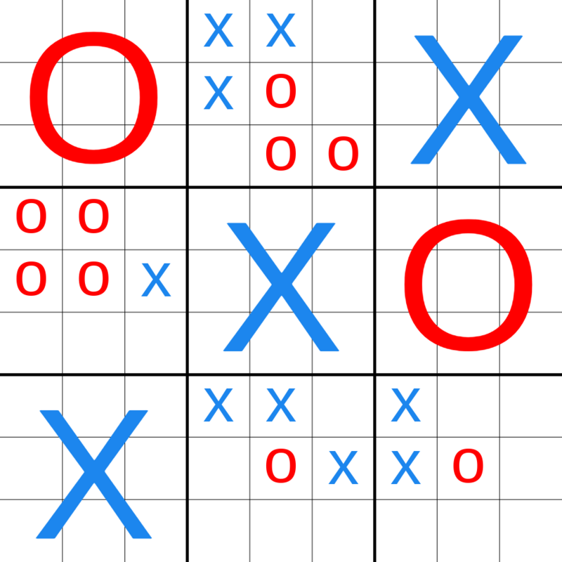

# Ultimate Tic-Tac-Toe AI

## Overview

This project features an AI-powered Ultimate Tic-Tac-Toe game. Ultimate Tic-Tac-Toe takes the classic game and adds a layer of complexity, with each cell of the Tic-Tac-Toe board containing another Tic-Tac-Toe board. The AI uses reinforcement learning to train itself for an arbitrary amount of time, continually improving its strategy. Players can choose to play the classic version or the more complex Ultimate version against the AI.

## Ultimate Tic-Tac-Toe: How It Works

In Ultimate Tic-Tac-Toe, each move affects which board the next player must play in. For example, if Player X places an 'X' in the top right square of a small board, Player O must play their next move on the small board located in the top right of the overall grid.

### Visual Explanation:

```
Main Board:      | Small Board:
[0][1][2]        | [0][1][2]
[3][4][5]  ->    | [3][4][5]
[6][7][8]        | [6][7][8]

- Each cell [0]-[8] in the Main Board contains a full Small Board.
- A move in cell [n] in any Small Board directs the next move to the Small Board at cell [n] in the Main Board.
```



<figcaption>
    Figure 1: Ultimate Tic-Tac-Toe game board illustration. Image from 
    <a href="https://commons.wikimedia.org/wiki/File:Ultimate_tic-tac-toe_X_victory.png">Wikimedia</a>
</figcaption>

## Installation

1. **Clone the Repository:**

   ```
   git clone https://github.com/yantavares/ultimate-tic-tac-toe-ai
   cd ultimate-tic-tac-toe-ai
   ```

2. **Install Dependencies:**
   - Ensure Python is installed on your system.
   - Install required packages using `requirements.txt`:
     ```
     pip install -r requirements.txt
     ```

## How to Play

1. **Start the Game:**

   - Launch the game by running a single script.
     ```
     python game.py
     ```

2. **Train the AI:**

   - Upon starting the script, you'll be prompted to enter the training duration for the AI. This step is optional; you can enter `0` or skip it to use the AI's existing training level.

3. **Choose Game Mode:**

   - After the AI training (if opted), you'll be prompted to choose between the Classic and Ultimate version of Tic-Tac-Toe.

4. **Game Rules:**

   - Follow the on-screen instructions to play against the AI. The game rules for both Classic and Ultimate Tic-Tac-Toe will be displayed.

## License

This project is licensed under the [GNU LICENSE](LICENSE).
